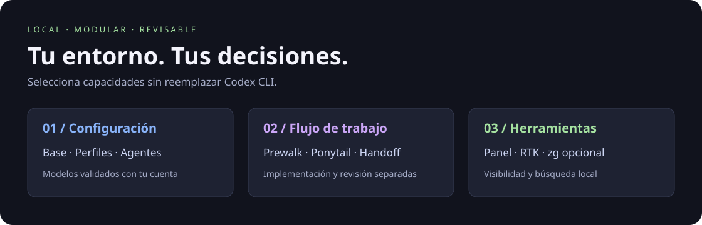
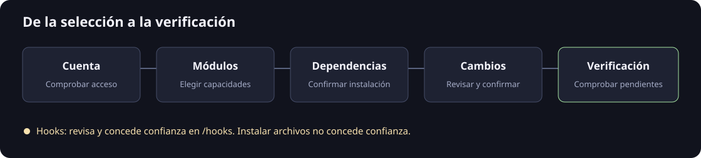

# Codex Setup

Configura tu entorno de Codex desde una terminal: módulos, perfiles, agentes,
revisión de código y un panel lateral. Elige qué instalar, revisa y confirma.
Proyecto independiente; no es un producto oficial de OpenAI.



## Empieza

Necesitas **Linux amd64 o arm64**, Codex CLI instalado y una sesión ChatGPT
iniciada con `codex login`. No incluye Codex ni credenciales. La instalación de
dependencias admite Ubuntu 24.04+, Debian 12+, Fedora 40+ y Arch Linux.
macOS y Windows no están soportados.

Descarga tu binario y `SHA256SUMS` desde
[Releases](https://github.com/OnishellT/codex-setup/releases/latest).
No necesitas Go ni clonar el repositorio: el payload está embebido.

```sh
# Para arm64, cambia el nombre del binario.
sha256sum --ignore-missing -c SHA256SUMS
chmod +x codex-setup-linux-amd64
./codex-setup-linux-amd64
```

**↑/↓** navega · **Espacio** selecciona · **m** elige modelos · **Enter** revisa.
Las dependencias y la configuración se confirman por separado.
Los paquetes del sistema pueden solicitar `sudo`.



## Qué incluye

| Módulo | Para qué sirve |
| --- | --- |
| `base` · `profiles` | Configuración compartida y perfiles personal/work. |
| `agents` · `prewalk` | Delegación nativa, worktrees, Qlty y revisión independiente. |
| `rtk` | Reduce la salida de comandos mediante un hook. |
| `ponytail` | Instrucciones y skills para mantener el código simple. |
| `context-handoff` | Alertas de contexto y traspasos compactos entre tareas. |
| `panel` | Panel lateral con agentes, logs, tokens y cuota. |
| `zg` **opcional** | Búsqueda semántica en índices locales; desmarcado por defecto. |

Los modelos se validan contra el catálogo de tu cuenta; puedes cambiarlos antes
de instalar. Las dependencias entre módulos se resuelven automáticamente.
Desmarcar un módulo **no lo desinstala**.

## Terminar y comprobar

Reinicia Codex. Si seleccionaste hooks, revísalos y concede confianza mediante
`/hooks`: el instalador nunca lo hace por ti. Abre una terminal nueva para
activar el panel en Bash/Zsh.

```sh
# Usa la misma selección que instalaste. No modifica archivos.
./codex-setup-linux-amd64 --modules base,profiles,agents,prewalk --check
```

«Archivos instalados» no equivale a «listo para usar»: la comprobación devuelve
un error mientras haya dependencias, archivos, modelos o hooks pendientes.

## Control local

- Vista previa y respaldos privados antes de sobrescribir archivos.
- Conserva configuración ajena; el merge TOML puede perder comentarios.
- No copia autenticación ni historiales, no confía hooks y no crea índices zg.
- RTK, Qlty y el runtime de zg usan instalaciones gestionadas verificadas.

Consulta la [guía de uso](docs/usage.md) para automatización, modelos,
destinos y recuperación. Guías específicas: [panel](payload/panel/README.md),
[Ponytail](payload/integrations/ponytail/README.md),
[RTK](payload/integrations/rtk/README.md) y [zg](payload/integrations/zg/README.md).

## Desarrollo

Go **1.26+**, Python **3.11+** y Make. La suite del panel necesita tmux y ncurses;
las pruebas de red son opt-in.

```sh
git clone https://github.com/OnishellT/codex-setup.git
cd codex-setup
make test check
make release                  # binarios amd64 y arm64 en bin/
./install.sh                  # usa el binario local
```

`internal/` contiene instalador y TUI; `payload/`, recursos embebidos;
`docs/`, guías e imágenes. Las pruebas permanecen junto al código.
No se versionan binarios, cachés ni credenciales.
Consulta [cómo añadir módulos](docs/usage.md#añadir-módulos) y la
[procedencia y licencias](docs/usage.md#procedencia).
