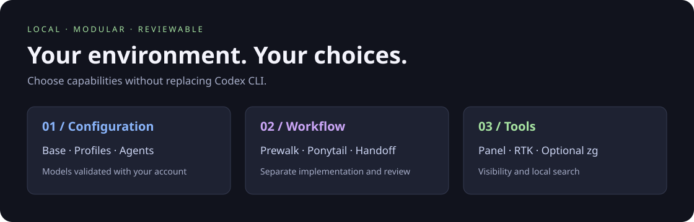
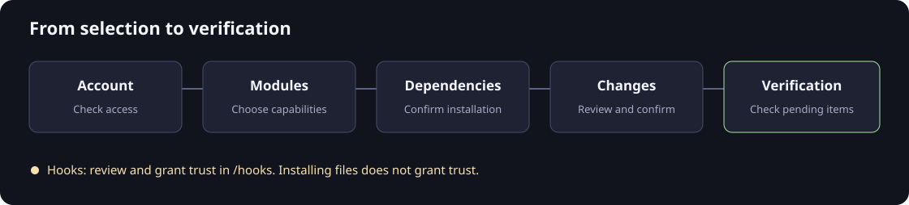

# Codex Setup

English · [Español](README.es.md)

Set up your Codex environment from the terminal: modules, profiles, agents,
code review, and a sidebar panel. Choose what to install, review, and confirm.
An independent project, not an official OpenAI product.



## Get started

You need **Linux amd64 or arm64**, Codex CLI installed, and a ChatGPT session
started with `codex login`. Codex and credentials are not included. Dependency
installation supports Ubuntu 24.04+, Debian 12+, Fedora 40+, and Arch Linux.
macOS and Windows are not supported.

Download your binary and `SHA256SUMS` from
[Releases](https://github.com/OnishellT/codex-setup/releases/latest).
No Go installation or repository clone is needed: the payload is embedded.

```sh
# For arm64, use the corresponding binary name.
sha256sum --ignore-missing -c SHA256SUMS
chmod +x codex-setup-linux-amd64
./codex-setup-linux-amd64
```

**↑/↓** navigate · **Space** select · **m** choose models · **Enter** review.
Dependencies and configuration changes require separate confirmations.
System packages may require `sudo`. The installer interface is in Spanish.



## What's included

| Module | Purpose |
| --- | --- |
| `base` · `profiles` | Shared configuration and personal/work profiles. |
| `agents` · `prewalk` | Native delegation, worktrees, Qlty, and independent review. |
| `rtk` | Reduces command output through a hook. |
| `ponytail` | Instructions and skills to keep code simple. |
| `context-handoff` | Context alerts and compact handoffs between tasks. |
| `panel` | Sidebar with agents, logs, tokens, and quota. |
| `zg` **optional** | Semantic search over local indexes; unchecked by default. |

Models are validated against your account's catalog and can be changed before
installation. Dependencies between modules are resolved automatically.
Unchecking a module **does not uninstall it**.

## Finish and verify

Restart Codex. If you selected hooks, review them and grant trust through
`/hooks`: the installer never does this for you. Open a new terminal to
activate the panel in Bash/Zsh.

```sh
# Use the same modules you installed. This does not modify files.
./codex-setup-linux-amd64 --modules base,profiles,agents,prewalk --check
```

“Files installed” does not mean “ready to use”: verification returns an error
while dependencies, files, models, or hooks remain pending.

## Local control

- Preview changes and create private backups before overwriting files.
- Preserve unrelated configuration; TOML merging may remove comments.
- Never copy authentication or history, trust hooks, or create zg indexes.
- RTK, Qlty, and the zg runtime use verified, managed installations.

See the [usage guide (Spanish)](docs/usage.md) for automation, models,
destinations, and recovery. Component guides:
[panel](payload/panel/README.md),
[Ponytail](payload/integrations/ponytail/README.md),
[RTK](payload/integrations/rtk/README.md), and [zg](payload/integrations/zg/README.md).

## Development

Go **1.26+**, Python **3.11+**, and Make. Panel tests require tmux and ncurses;
network tests are opt-in.

```sh
git clone https://github.com/OnishellT/codex-setup.git
cd codex-setup
make test check
make release                  # amd64 and arm64 binaries in bin/
./install.sh                  # uses the local binary
```

`internal/` contains the installer and TUI; `payload/`, embedded resources;
`docs/`, guides and images. Tests stay alongside the code.
Binaries, caches, and credentials are not tracked.
See [adding modules](docs/usage.md#añadir-módulos) and
[provenance and licenses](docs/usage.md#procedencia) (Spanish).
